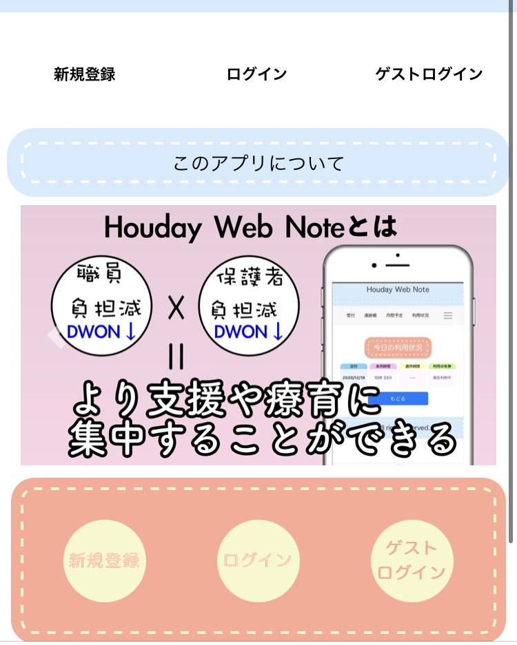
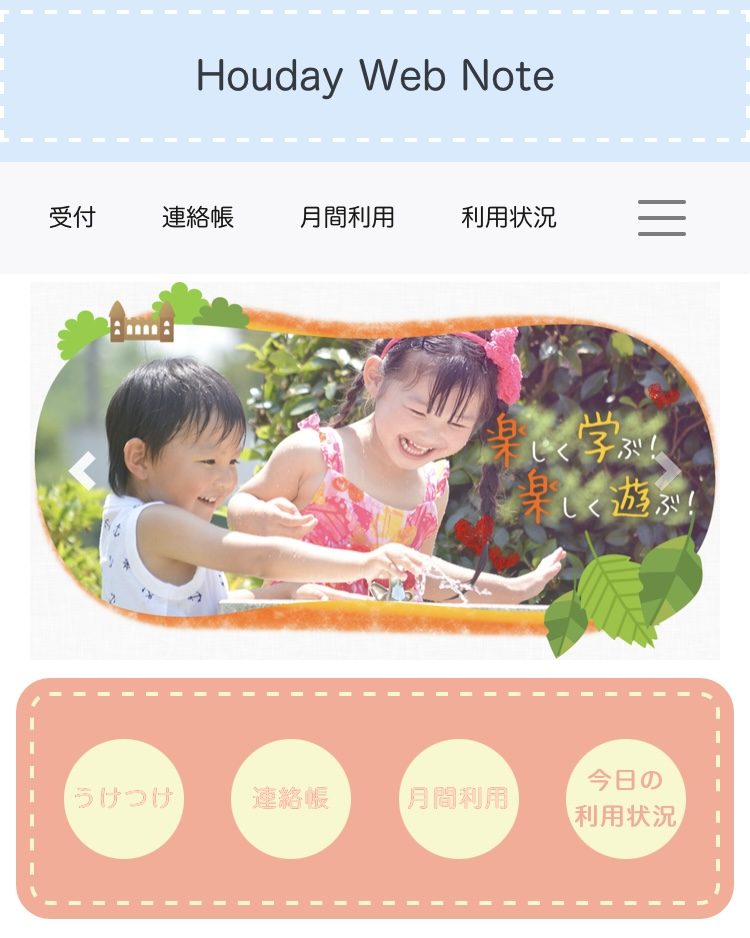
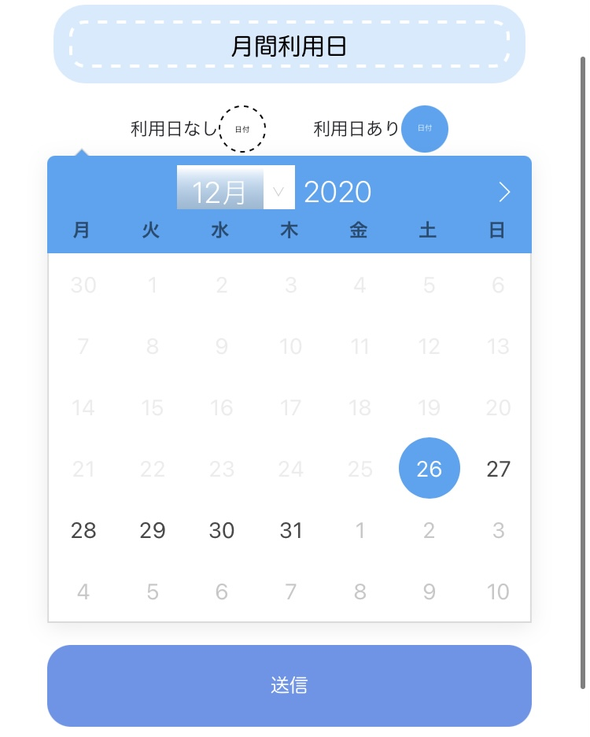
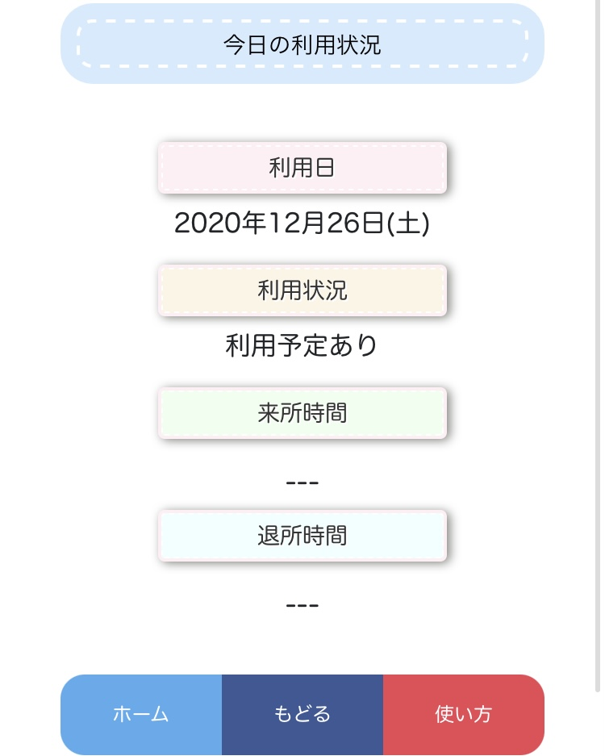
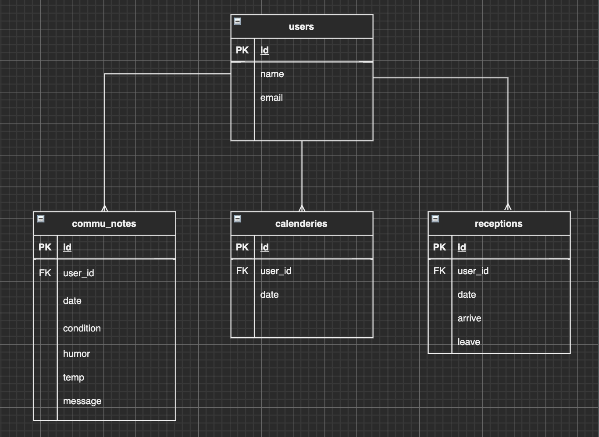

# オリジナルアプリの作成

## サンプル画像

| トップ画面（ログイン前）              | トップ画面（ログイン後）              |
| ------------------------------------- | ------------------------------------- |
|  |  |

| 月間利用日投稿画面                    | 今日の利用状況確認画面                |
| ------------------------------------- | ------------------------------------- |
|  |  |

---

## どんなアプリを作りたいか？

- 転職活動に使えるアプリ
- 自分なりの工夫がされたアプリ
- 作りたい動機がしっかりしているアプリ

---

## なぜこのアプリを作ったか？

- 職員と保護者の負担を減らして、支援・療育に集中することができる環境を実現するため
- 具体的な理由は以下の３点

1. 支援中に連絡帳を記入する必要があり、子供から目を離す時間が生じるから
2. 子供が頻繁に連絡帳を忘れたり、失くしたりするから
3. 保護者との連絡手段が対面か電話に限られているから

---

## 工夫した３つの点

1. Bootstrap をできるだけ使わずフロントの部分を作成したところ
2. フッターメニューの設置、モーダルで使い方を表示など、利用者目線で作成した
3. カレンダーの日付を直接クリックすることで、簡単に利用日を決めることができるようにしたところ

---

## 実装した機能

### ログイン機能

- gem の divise を利用

### 受付機能

- ボタンを押して現在時刻を非同期通信で表示する
- 今日の利用予定がない場合、受付できない仕様にする

### 月間利用日投稿機能

- javascrip のライブラリ flatpickr のカレンダーを利用
- 今日から３０日後までの範囲で利用日を選択できるよう制限
- カレンダーからのパラメータはそのままでは DB に保存できないため、パラメータを DB に保存できる形に変更をする

### 連絡帳の投稿機能

- 今までの連絡帳一覧を確認、編集、削除できる仕様
- gem の kaminari を使ってページネーションを実装
- 今日の利用予定がないと連絡帳の記入ができない仕様にする

### 今日の利用状況確認機能

- 受付機能の時間を反映させる
- 受付の有無によって、現在利用中かどうかを判断する

---

## 使用の流れ（アプリの使用者は保護者）

1. ログインをする

2. 月間の利用日を決める

### 利用予定日当日

1. ログインをする
2. 連絡帳を記入をする
3. 『今日の利用状況』から現在こどもが利用しているか気軽に確認可能

## データベース設計

<!--  -->
